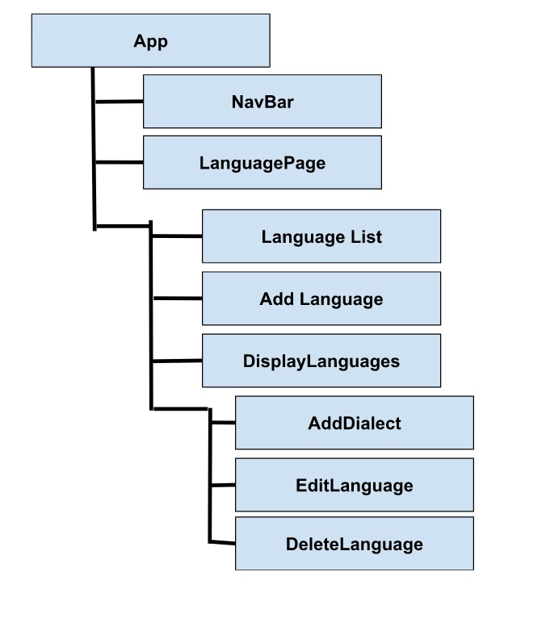

<h1><strong>Welcome to Patrick's Language Database!</strong></h1> 

This database keeps an updated record of languages and their dialects, as well as the number of speakers per language. When you discover a new language, you can add it to the database, along with it's dialects. 

<h3><strong>Getting Started</strong></h3>

The back-end server and the front-end react code are all contained within a single repository. Once you create a fork and open the repository in your terminal, you will first need to start the server, and then start the front-end. 

<h4><strong>Starting the back end server</strong></h4>

To start the server, in your terminal, change into the "app" folder. Once you do this, run the command "bundle exec rake server". This will start running the back-end server.  

~/phase-3-sinatra-react-project$ cd app
~phase-3-sinatra-react-project/app$ bundle exec rake server

<h4><strong>Starting the front end browser</strong></h4>

After you start the server, open a new terminal, and cd into the front-end of the repository by changing into the "my-app-frontend" folder. Once you do this, run the command "install", followed by "npm start". The first command will install the necessary gems, and the second command will open a new tab in your browser. Now you are ready to start using the site! 

~phase-3-sinatra-react-project$ cd my-app-frontend
~phase-3-sinatra-react-project/my-app-front-end$ bundle install
~phase-3-sinatra-react-project/my-app-front-end$ npm start

<h4><strong>Optional Default Data:</strong></h4> 

The repository has a seed data file which contains three default languages and their associated dialects. If you would like to start the site with these default languages already on the page, open a new terminal, cd into the app file, and run the command rake db:seed.

~phase-3-sinatra-react-project/app$ rake db:seed

<h3><strong>Create A Language</strong></h3>

In order to add a language, simple click the "Add a Language" button. Once your language is added, you will also be able to add dialects to that particular language. 

If you need to edit the name of a language, select a language, and the click the "edit" button. If you need to delete a language, use the delete button. 

<h3><strong>Roadmap of Components</strong></h3>

Below is a roadmap of the React components. 

<h4>Future Goals</h4>

The next step for this app would be to allow users to add dialects at the same time they add a language. This would reduce the number of steps a use needs to take to create a new language entry. I would also like to add a drop-down filter, so that when the list of languages gets very large, all of them can be easily seen and accessed. 